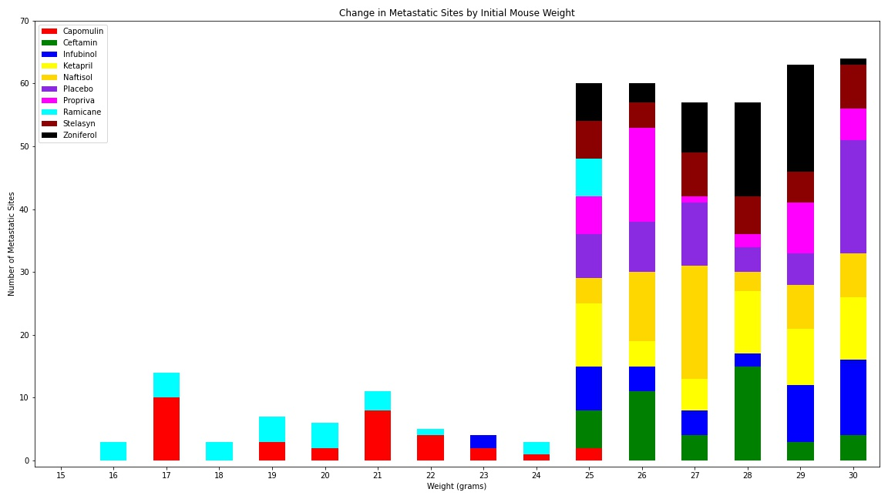

# matplotlib-drug-study  

Author:  Erin James Wills, ejw.data@gmail.com  

  
<cite>Photo by [Louis Reed](https://unsplash.com/@_louisreed?utm_source=unsplash&utm_medium=referral&utm_content=creditCopyText) on [Unsplash](https://unsplash.com/s/photos/lab-rat?utm_source=unsplash&utm_medium=referral&utm_content=creditCopyText)</cite>  

   

## Overview  
This repo includes data and a jupyter notebook analysis of a drug efficacy study comparing the effects of multiple cancer treatment drugs within a population of cancer inoculated mice.  A tumor was grown in each mouse such that each mouse in the study had a 45 mm**3 tumor at day zero of the study.  Measurements of the tumor volume and cancer spread (metastatic sites) were taken every 5 days until the study concluded after 45 days.  Initial goals were to compare the treatment outcomes by analyzing the volume and metastatic site growth and any outliers over the course of the study.  A second review was added to the analysis to more critically examine potential reasons that two drugs performed better than the other treatments.  A third review will also be added in the future that will consider the outcomes relative to the placebo population included in the dataset.     

   

## Technologies  
*  Python
*  Pandas
*  Matplotlib
*  Scipy Stats  

 

## Methods  
*  Scatter plots
*  Line charts 
*  Line charts with errorbars  
*  Bar charts   
*  Stacked bar charts
*  Histograms
*  Box plots  
*  Determination of outliers
*  Central Tendency
*  Linear Regression  

 

## Data Source  
*  The datasource is unknown, exepct that Trilogy Education Services may have generated the dataset for their bootcamps.  
*  The data set consists of two files that contain information about the mice used in the study and tumor volume and metastatic site measurements taken throughout the 45 day study.  There are 249 mice specimens and 1893 specimen measurements.  
*  The data can be accessed in the `data` folder as well as an older pair of files containing less information.  

   

## Setup and Installation  
1. Environment needs the following:  
    *  Python 3.6+  
    *  Pandas
    *  Matplotlib.pyplot
    *  Matplotlib.patches  (used only for generating a chart legend)
    *  Scipy

1. Activate your environment
1. Clone the repo to your local machine
1. Start Jupyter Notebook within the environment from the repo
1. Run `drug_analysis.ipynb` 

 

## Analysis  

> This analysis includes the results of two reviews.  

From the initial review of data, it appeared that two drug treatments showed promising outcomes.  Capomulin and Ramicane were the only two drugs that showed a decrease in tumor size (Fig.1, Fig.4) and reduced rates of development of metastatic cancer sites (Fig.2). The mouse survival rate was also much better for these drugs (Fig.3).  From this data, Capomulin and Ramicane were determined to be `potential` target drugs for this cancer.   

After receiving additional information about each mouse and further investigation, the previous conclusions, are now doubted.  After looking at the mouse populations, the mice used for Capomulin and Ramicane had one similarity that none of the other treatment or control groups had - lower weight mice.  The age distribution did not seem to influence the outcome of the study; although, some of the ages did seem somewhat low.  The average weight for mice treated with Capomulin had on average a 24.7 gram intial weight and the mice treated with Ramicane had a 24.6 gram average weight.  All other groups of mice had an average weight of 27.2 or greater.  The distribution of weights showed a distinct difference (Fig.5, Fig.6).  The number of metastatic sites compared to initial mouse weight (Fig.7) also showed significant differences compared to the other mice.    It is uncertain if the drug or initial weight or a combination of the two factors caused a reduction in tumor volume and reduced cancer spread.  

Further analysis will be performed using the control group (placebo group).

<figure>

<figcaption>Fig.1 - Tumor Volume Change After 45 Days </figcaption>  
</figure>

 

<figure>

<figcaption>Fig.2 - Metastatic Site Spread During Treatment Period</figcaption>
</figure>

 

<figure>
  
<figcaption>Fig.3 - Percent of Mice Survived Over Treatment Period </figcaption>
</figure>

 

<figure>

<figcaption>Fig.4 - Tumor Volume and Outliers per Treatment (last measurement) </figcaption>
</figure>

 

<figure>

<figcaption>Fig.5 - Distribution of Mouse Data</figcaption>
</figure>

 

<figure>

<figcaption>Fig.6 - Tumor Volume Changes versus Initial Mouse Weight</figcaption>
</figure>

 

<figure>

<figcaption>Fig.7 - Metastatic Sites Changes versus Initial Mouse Weight</figcaption>
</figure>

 

## Notes
*  Updated data and improved dataframe naming
*  Added additional analysis
*  Rewrote readme